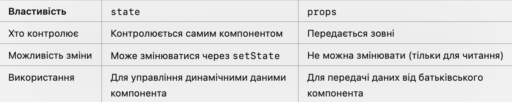

# State

### Що таке стан у React?

Стан (state) — це об’єкт, який дозволяє зберігати динамічні дані всередині компонента. На відміну від пропсів (props),
стан контролюється самим компонентом і
може змінюватися протягом життєвого циклу компонента. Ми поки що не знаємо, що таке життєвий цикл компонента, але ми
обовʼязково поговоримо про це пізніше.

Порівняльна таблиця між state і props:


Дивіться файли - lesson-files/state/src/components/Clock.jsx

Раніше створені компоненти були stateless (без стану), тобто не містили жодного внутрішнього стану та могли лише
відображати передані властивості.
Компонент у прикладі вище є stateful (зі станом), оскільки зберігає всередині себе стан поточного часу. Розглянемо це
крок за кроком:

### Ініціалізація стану.

Всередині компонента, у конструкторі, визначається початковий стан, з яким компонент буде ініціалізовано після
відображення.
Єдина вимога до стану в React — це те, що він має бути об’єктом. Те, що саме зберігається в стані, визначається самим
додатком.

Приклад завдання початкового стану:

```js
class Clock extends React.Component {
    constructor(props) {
        super(props); // обов'язково викликати super(props)
        this.state = {date: new Date()};
    }

    render() {
        return <h1>Зараз: {this.state.date.toLocaleTimeString()}</h1>;
    }
}
```

**Важливі моменти:**

1. Стан — це об’єкт.
2. Зверніть увагу, що це єдине місце, де стан може змінюватися безпосередньо (точніше, створюватися). В усіх інших
   місцях this.state має використовуватися лише для читання! Докладніше про це далі.
3. Функція render використовує дані зі стану для відображення. Тут немає несподіванок.
4. Для оновлення стану використовується лише метод setState.
5. На кнопку додається обробник події кліку. На відміну від HTML, у властивість onClick передається функція, яка викликається автоматично в момент спрацювання події.
   Всередині обробника визначається поточна дата та встановлюється новий стан. Ще раз: вкрай важливо не змінювати стан безпосередньо. Для встановлення нового стану в React передбачена функція setState. 
   Саме її виклик призводить до того, що компонент, зрештою, перемальовується. Це відбувається асинхронно, оскільки setState оптимізує процес оновлення.

### Оновлення стану через setState.

Метод setState використовується для оновлення стану. Він працює асинхронно, що дозволяє React оптимізувати процес
оновлення.

```js
this.setState({ключ: новеЗначення});
```

### Робота з обробниками

У прикладі функція handleClick визначена так:
```js
class Clock extends React.Component {
  handleClick() {
    this.setState({ date: new Date() });
  }
}
```

**Такий підхід має два недоліки:**

1.	Втрачання контексту. Оскільки методи в класах є звичайними функціями з пізнім зв’язуванням, при передачі handleClick як обробника контекст this втрачається. 

**Пізнє зв’язування (іноді називається динамічним зв’язуванням)** — це механізм, за якого під час виконання програми визначається, яку саме функцію, метод або об’єкт викликати. 
Іншими словами, остаточне вирішення того, який код буде виконаний, відбувається під час виконання програми, а не під час її компіляції.

Для вирішення цього потрібно писати:
```js
onClick={this.handleClick.bind(this)}
```
або
```js
onClick={() => this.handleClick()}
```

2. Продуктивність. У попередніх прикладах при кожному виклику render створюється новий обробник, що погано впливає на продуктивність React.
Правильний спосіб визначення обробника — це використання стрілочної функції:
```js
class Clock extends React.Component {
  handleClick = () => {
    this.setState({ date: new Date() });
  };
}
```

### Приклад: Збільшення лічильника

Дивіться файли - lesson-files/state/src/components/Counter.jsx

```js
class Counter extends React.Component {
  constructor(props) {
    super(props);
    this.state = { count: 0 };
  }

   handleClick = () => {
      this.setState({ count: this.state.count + 1 });
      this.setState({ count: this.state.count + 1 });
   };

  render() {
    return (
            <button onClick={this.handleClick}>count: {this.state.count}</button>
    );
  }
}
```

На перший погляд здається, що лічильник має збільшуватися на 2 при кожному кліку. 
Але цього не відбувається, чому? Розберемося далі.

### Як працює setState?

**Асинхронність setState.**
setState не оновлює стан миттєво. React об’єднує кілька викликів setState для оптимізації.
```js
this.setState({ count: this.state.count + 1 });
this.setState({ count: this.state.count + 1 }); // count збільшиться лише на 1
```

Для правильного оновлення використовуйте функціональний підхід:
```js
this.setState((state, props) => {
   const { count } = state;

   return { count: count + 1 };
})
```

**Часткове оновлення стану.**
setState об’єднує новий об’єкт стану з попереднім. Це означає, що вам не потрібно копіювати весь стан вручну:
```js
this.setState({ key1: 'value1' }); // інші ключі залишаються незмінними
```

### Ініціалізація зі значенням за замовчуванням.

Якщо потрібно ініціалізувати лічильник зі значенням count, переданим ззовні, і лише за його відсутності встановити 0, то можна зробити так:
1.	Використати властивість count як початкове значення.
2.	Додати значення за замовчуванням для count.

Дивіться файли - lesson-files/state/src/components/CounterV2.jsx

### setState

В наступному прикладі реалізовані дві кнопки, кожна з яких керує своїм станом.

> lesson-files/state/src/components/Buttons.jsx

В даному прикладі обʼєкт стану включає два стани: count для однієї кнопки і primary
для другої. Основна хитрість цього прикладу заключається в процессі оновлення стану:

```js
// первая кнопка
this.setState(({ count }) => ({ count: count + 1 }));

// вторая кнопка
this.setState(({ primary }) => ({ primary: !primary }));
```

Функція setState замінює значення ключів в попередньому стані на значення цих же ключів
в новому стані. Те, що всередині функції не поверталося – не ціпається. Фактично
відбувається зливання старого стану і нового. На практиці ця поведінка дуже зручна,
інакше довелося б кожен раз виконувати злиття вручну.

## Структура обʼєкту стану

Існує багато способів організації даних всередині стану. Скоріше за все, ви захочете
зберігати їх якось так:

> lesson-files/state/src/components/exampleStateWrong.jsx

При такому підході сутності, які залежать від інших, знаходяться всередині. Якщо брати приклад вище,
то це значить, що кожен пост має всередині себе як автора, так і список коментарів,
а кожен коментар, в свою чергу, має в собі свої звʼязані сутності того ж автора. 
При такому підході виходить, що стан являє собою дерево залежностей. Хоча цей спосіб організації здається цілком правильним, працювати з
ним дуже важко. 
1. По-перше, одні і ті самі дані почнуть дублюватися в різних місцях і вам доведеться синхронізувати зміни в них, що створює абсолютно космічні
проблеми на пустому місці. 
2. По-друге, оновлення таких даних (особливо в незмінному стилі) стають складними і багатослівними. 
3. По- третє, так як весь стан це один великий шматок, то будь-яке оновлення приведе до його повного копіювання, що може бути
дорогою операцією (в залежності від розміру стану і кількості оновлень в одиницю часу).

Загальна рекомендація, яку дають розробники React - це робити структуру максимально пласкою, схожою на те, як зберігаються дані в базі даних. 
Причому бажано в нормалізованому вигляді. 
Іншими словами, не потрібно дублювати дані в стані. 
Приклад того, як правильно це робити:

> lesson-files/state/src/components/exampleStateRight.jsx


